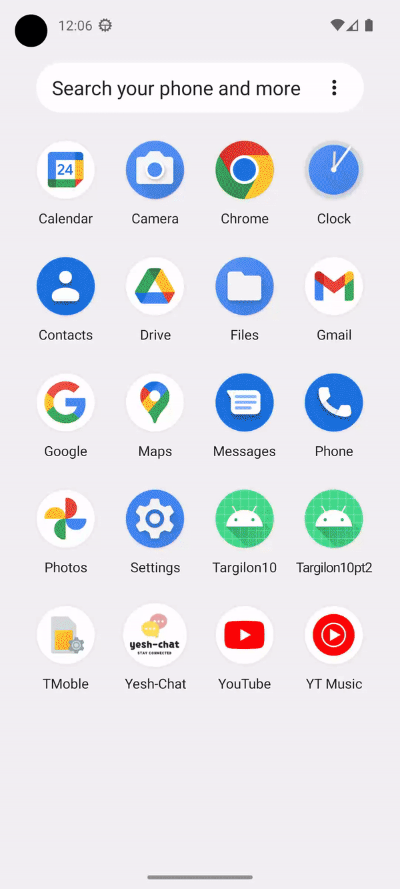

# Yesh-Chat Android Application

Welcome to Yesh-Chat! 
This project is a messaging application developed using Android Studio, with a server-side implementation in Node.js. The application allows users to register, log in, add contacts, and send messages. 
Our Android application serves as an extension of our website, providing users with a seamless mobile experience.

## Features

The Yesh-Chat Android Application offers the following features:

- **User Registration**: Users can create a new account by providing their username, password, display name, and profile picture. These details are used to personalize the user's profile within the application.

- **User Login**: Registered users can log into their accounts using their username and password. The login process validates the user's credentials and grants access to the application's features.

- **Contact Management**: Users can add contacts to their list by searching for them using their username. This allows users to establish connections and start conversations with their contacts.

- **Messaging**: Users can communicate with their contacts through one-on-one conversations.

- **Theme Settings**: The application provides a screen settings feature that allows users to change the theme of the application according to their preferences. There are 2 available themes - Light and Dark. This feature enhances the visual experience and customization options for users.

- **Server Connection Configuration**: The application allows users to change the server connection URL. By accessing the settings screen, users can modify the default server connection address to connect to a different server.

- **Server Implementation**: The server side of the application is developed using Node.js. It listens on port 5000 and handles user authentication, contact management, and message delivery. The server utilizes the mongoose library to connect to MongoDB for data storage.

- **Architecture**: The Yesh-Chat Android Application follows the View-ViewModel-Repository (MVVM) architectural pattern. This separation of concerns improves code organization, maintainability, and testability.

## Getting Started

To set up and run the Yesh-Chat Android Application, follow these steps:

1. **Prerequisites**: Make sure you have Android Studio and Node.js installed on your development machine. You will also need a compatible Android device or emulator to run the application.

2. **Clone the Repository**: Clone the project repository to your local machine.

3. **Set up the Server**: Navigate to the server directory within the project by running `cd server` and install the required dependencies by running `npm install`. Start the server by running `npm start`. Please insure MongoDB is active and running for allowing the server to establish a connection.

4. **Build and Run**: Open the Android project in Android Studio and build the application. Run the application on your Android device or emulator.

5. **Register and Log in**: Create a new account by providing your username, password, display name, and profile picture. Once registered, log in using your username and password.

6. **Explore and Enjoy**: Start adding contacts, sending messages, and customize the application theme according to your preferences.

## Technologies Used

The Yesh-Chat Android Application utilizes the following technologies:

- **Android Studio**: The integrated development environment (IDE) used for building the Android application.
- **Java**: The programming language used for Android app development.
- **Node.js**: The JavaScript runtime used for the server-side implementation.
- **Express**: A web application framework for Node.js used to create the server.
- **MongoDB**: A NoSQL database used for data storage, accessed through the mongoose library.
- **Retrofit**: A type-safe HTTP client for Android used for server communication.
- **Gson**: A library used for JSON serialization and deserialization in the Android application.

## Screenshots and GIFs

Here are some GIFs showcasing the activities of the WhatsApp Android Application:

 
 
*Registration Activity*

 
 
*Chat Activity*

Thank you for using the Yesh-Chat Android Application! We hope you enjoy the messaging experience it offers.
