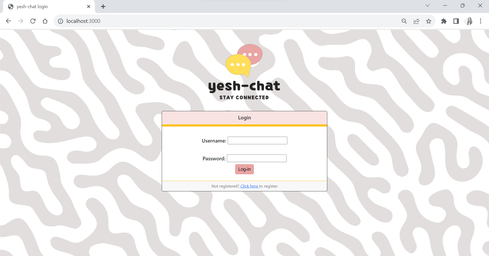
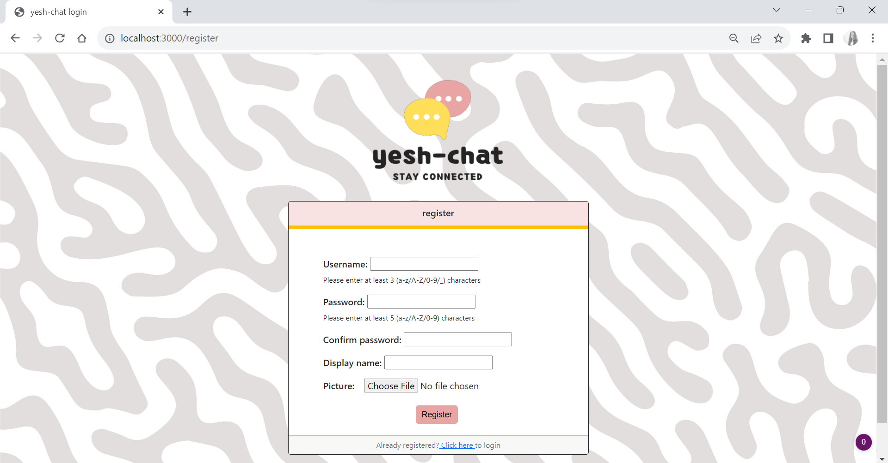
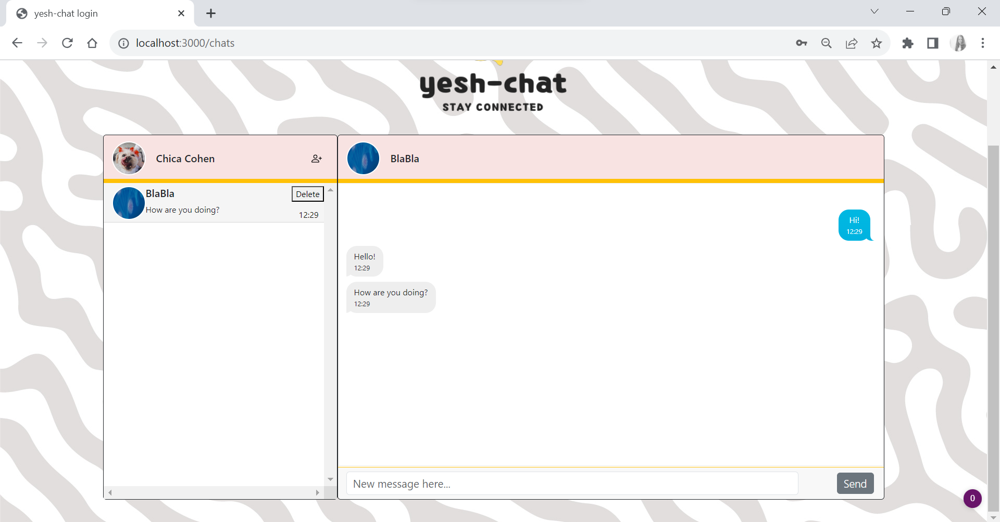

# Yesh-Chat Web Application

Welcome to Yesh-Chat! This project is a web-based messaging application with a server-side implementation in Node.js and MongoDB for data storage. The client side is built using React, and websockets are utilized to provide real-time message alerts.

## Features

The Yesh-Chat Web Application offers the following features:

- **User Registration**: Users can create a new account by providing their username, password, display name, and profile picture. These details are used to personalize the user's profile within the application.

- **User Login**: Registered users can log into their accounts using their username and password. The login process validates the user's credentials and grants access to the application's features.

- **Contact Management**: Users can add contacts to their list by searching for them using their username. This allows users to establish connections and start conversations with their contacts.

- **Messaging**: Users can communicate with their contacts through one-on-one conversations, with real-time message alerts using websockets.

- **Server Connection Configuration**: Users can modify the default server connection address to connect to a different server.

- **Server Implementation**: The server side of the application is developed using Node.js. It handles user authentication, contact management, and message delivery. MongoDB is used for data storage.

- **Architecture**: The Yesh-Chat Web Application follows a modern and scalable architecture, with React components and state management for a seamless user experience.

## Getting Started

To set up and run the Yesh-Chat Web Application, follow these steps:

1. **Prerequisites**: Make sure you have Node.js installed on your development machine.

2. **Clone the Repository**: Clone the project repository to your local machine.

3. **Enter Project Directory**: Open a terminal and navigate to the project directory by running `cd yesh-chat`.

4. **Install Dependencies**: Install the required dependencies by running `npm install`.

5. **Start the App**: Start the application by running `npm start`.

6. **Register and Log in**: Open the application in your web browser and create a new account by providing your username, password, display name, and profile picture. Once registered, log in using your username and password.

7. **Explore and Enjoy**: Start adding contacts and sending messages! 

## Technologies Used

The Yesh-Chat Web Application utilizes the following technologies:

- **React**: The JavaScript library used for building the user interface.
- **Node.js**: The JavaScript runtime used for the server-side implementation.
- **Express**: A web application framework for Node.js used to create the server.
- **MongoDB**: A NoSQL database used for data storage.
- **Websockets**: Used for real-time message alerts.
- **React Router**: A library used for navigation in the React application.

## Screenshots

Here are some screenshots showcasing the Yesh-Chat Web Application:

 
*Login Page*

 
*Registration Page*

 
*Chats Page*

Thank you for using the Yesh-Chat Web Application! We hope you enjoy the messaging experience it offers.